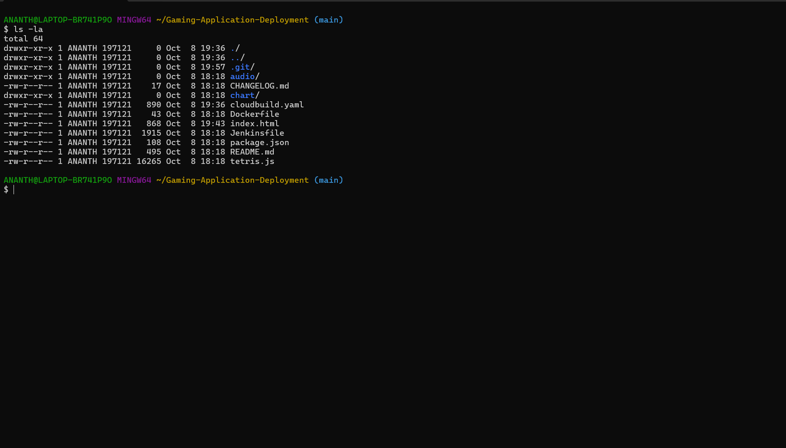
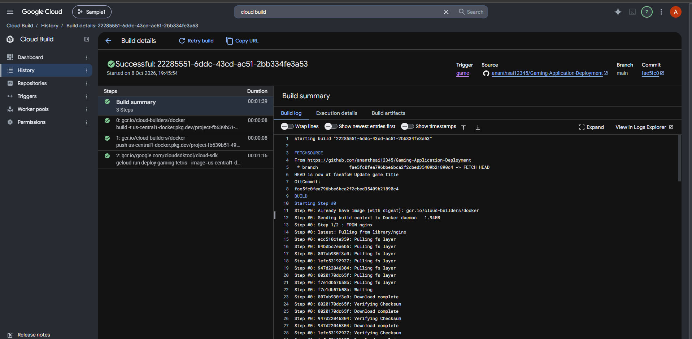
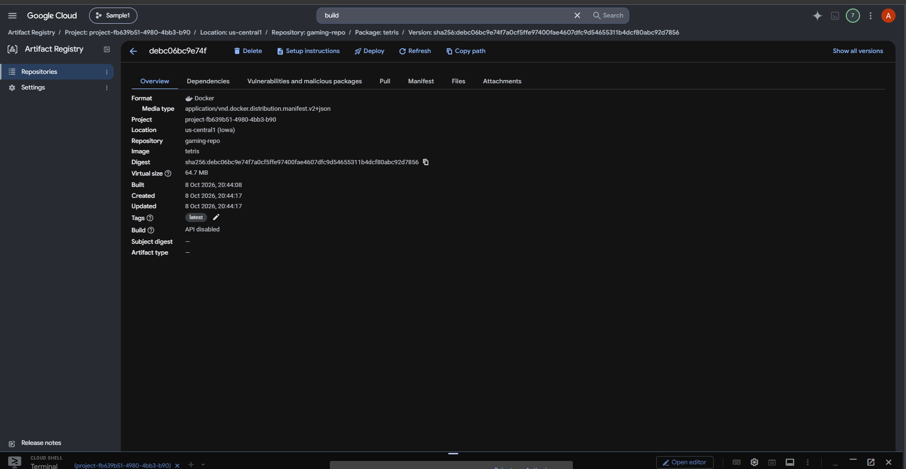
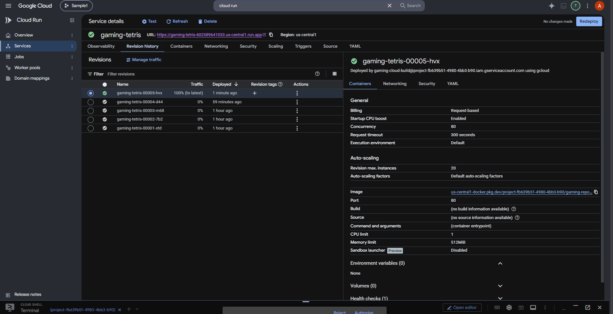
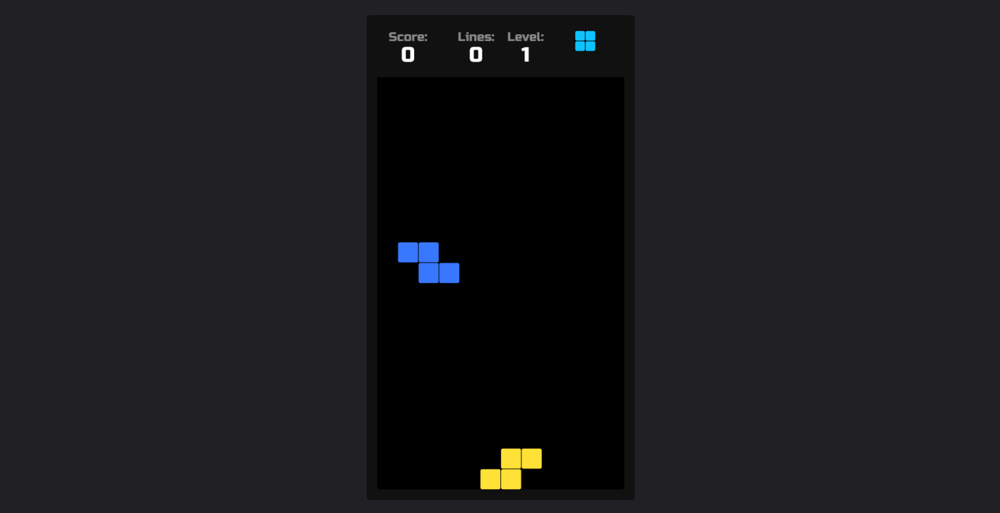

# 🎮 Tetris — GCP CI/CD Deployment

A containerized HTML5 Tetris application deployed on **Google Cloud Platform** using an automated **CI/CD pipeline**.

The project demonstrates how a code change pushed to GitHub can automatically trigger a pipeline that builds a Docker image, stores it in Artifact Registry, and deploys the updated application to Cloud Run.

---

## 🏗️ Architecture

```text
                    Developer
                        │
                        │ git push
                        ▼
                 ┌──────────────┐
                 │    GitHub    │
                 └──────┬───────┘
                        │
                        │ Push to main
                        ▼
              ┌─────────────────────┐
              │   Cloud Build       │
              │                     │
              │  1. Docker Build   │
              │  2. Push Image     │
              │  3. Deploy         │
              └─────────┬───────────┘
                        │
                        ▼
             ┌──────────────────────┐
             │  Artifact Registry   │
             │                      │
             │   Docker Image       │
             └──────────┬───────────┘
                        │
                        │ Container Image
                        ▼
                 ┌──────────────┐
                 │  Cloud Run   │
                 │              │
                 │ gaming-tetris│
                 └──────┬───────┘
                        │
                        ▼
                 🌐 Live Website
                   Tetris Game
```

---

## 🚀 Project Overview

This project takes a simple HTML5/JavaScript Tetris game and deploys it as a Docker container on Google Cloud.

The main objective is to demonstrate a practical DevOps workflow:

**Code → GitHub → Cloud Build → Docker → Artifact Registry → Cloud Run**

The deployment is fully automated. After a change is pushed to the `main` branch, Cloud Build automatically builds and deploys the updated application.

---

## 🛠️ Technology Stack

| Technology | Purpose |
|---|---|
| Git | Version control |
| GitHub | Source code repository |
| Docker | Containerization |
| Nginx | Web server for the static application |
| Google Cloud Build | CI/CD pipeline |
| Cloud Build Triggers | Automatic pipeline execution |
| Artifact Registry | Docker image storage |
| Cloud Run | Container deployment |
| IAM | Identity and access management |

---

## 🔄 CI/CD Workflow

### 1. Developer changes the application

Application code is modified locally.

### 2. Push to GitHub

The changes are committed and pushed to the `main` branch.

```bash
git add .
git commit -m "Update application"
git push origin main
```

### 3. Cloud Build Trigger

A Google Cloud Build trigger monitors the GitHub repository.

When a push occurs on the `main` branch, the trigger automatically starts a build.

### 4. Docker Image Build

Cloud Build reads the project's `Dockerfile` and creates a container image.

```dockerfile
FROM nginx

COPY . /usr/share/nginx/html/
```

Nginx serves the HTML, JavaScript, audio and other static application files.

### 5. Push to Artifact Registry

The newly built Docker image is pushed to:

```text
us-central1-docker.pkg.dev/<PROJECT_ID>/gaming-repo/tetris
```

Artifact Registry provides managed storage for the container image.

### 6. Deploy to Cloud Run

Cloud Build deploys the container image to the Cloud Run service:

```text
gaming-tetris
```

Cloud Run creates a new revision and routes traffic to the latest successful deployment.

### 7. Application becomes available

The updated Tetris application is automatically available through the Cloud Run URL.

---

## 🐳 Docker Configuration

The application is packaged using Nginx.

```dockerfile
FROM nginx

COPY . /usr/share/nginx/html/
```

The application files are copied into Nginx's default web directory:

```text
/usr/share/nginx/html/
```

Nginx listens on port `80`, so Cloud Run is configured to expose the container on port `80`.

---

## ⚙️ Cloud Build Pipeline

The CI/CD pipeline is defined in:

```text
cloudbuild.yaml
```

The pipeline performs three main operations:

```text
1. Build Docker Image
          ↓
2. Push Image to Artifact Registry
          ↓
3. Deploy Image to Cloud Run
```

The pipeline also uses Cloud Logging for build logs.

---

## 🔐 IAM and Service Account

A dedicated Google Cloud service account is used by Cloud Build.

The service account provides the permissions required for the CI/CD pipeline to:

- Push container images to Artifact Registry
- Deploy the application to Cloud Run
- Write build logs
- Act as the required deployment identity

This demonstrates the use of **IAM-based machine identities** rather than relying on a personal user account for automated deployment.

---

## 📦 Project Structure

```text
gcp-tetris-cicd-deployment/
│
├── audio/
├── chart/
├── cloudbuild.yaml
├── Dockerfile
├── index.html
├── tetris.js
├── package.json
├── CHANGELOG.md
├── Jenkinsfile
└── README.md
```

> **Note:** The `Jenkinsfile` is retained from the original application repository. It is not used by the current GCP CI/CD pipeline.

---

## 📸 Project Screenshots

### GitHub Repository



### Cloud Build — Successful Pipeline



### Artifact Registry



### Cloud Run



### Live Tetris Application



---

## 🧪 Automated Deployment Demonstration

The CI/CD pipeline was tested by modifying the application's page title.

The change was committed and pushed to GitHub:

```text
Update game title
```

The GitHub push automatically triggered Cloud Build.

Cloud Build then:

```text
GitHub Commit
      ↓
Cloud Build Trigger
      ↓
Docker Build
      ↓
Artifact Registry
      ↓
Cloud Run Deployment
      ↓
New Cloud Run Revision
```

No manual Cloud Build execution or manual Cloud Run deployment was required for the final deployment test.

---

## 🧩 Challenges & Solutions

### Cloud Run Container Port

The initial Cloud Run deployment failed because the container was listening on port `80`, while Cloud Run was configured to expect port `8080`.

The issue was resolved by configuring Cloud Run to use:

```text
Port: 80
```

This matched the default Nginx configuration used by the container.

---

### Cloud Build Service Account

A dedicated service account was configured for the CI/CD pipeline.

The required IAM permissions were assigned so that Cloud Build could interact with Artifact Registry, Cloud Run and Cloud Logging.

---

### Cloud Build Logging

Because a user-managed service account was used, Cloud Build required an explicit logging configuration.

The pipeline was configured to use:

```yaml
options:
  logging: CLOUD_LOGGING_ONLY
```

---

## 📚 DevOps Concepts Demonstrated

This project demonstrates practical understanding of:

- Continuous Integration
- Continuous Deployment
- Git-based CI/CD
- Docker containerization
- Docker image management
- Artifact Registry
- Cloud Build
- Cloud Build Triggers
- Cloud Run
- IAM
- Service Accounts
- Cloud Logging
- Container ports
- Cloud Run revisions
- Automated deployments

---

## 🔮 Future Improvements

Possible improvements for a larger production-oriented implementation:

- Add automated application testing
- Add container vulnerability scanning
- Use immutable image tags instead of `latest`
- Add Terraform for Infrastructure as Code
- Add monitoring and alerting
- Add a staging environment
- Add deployment approval gates
- Implement rollback strategies
- Add observability with metrics and dashboards

---

## 🎯 Learning Outcome

This project helped demonstrate the complete lifecycle of a containerized application:

```text
Source Code
    ↓
Version Control
    ↓
CI/CD Automation
    ↓
Container Build
    ↓
Container Registry
    ↓
Cloud Deployment
    ↓
Live Application
```

It provides a practical foundation for building more advanced DevOps projects involving Kubernetes, Terraform, Jenkins, monitoring and infrastructure automation.
